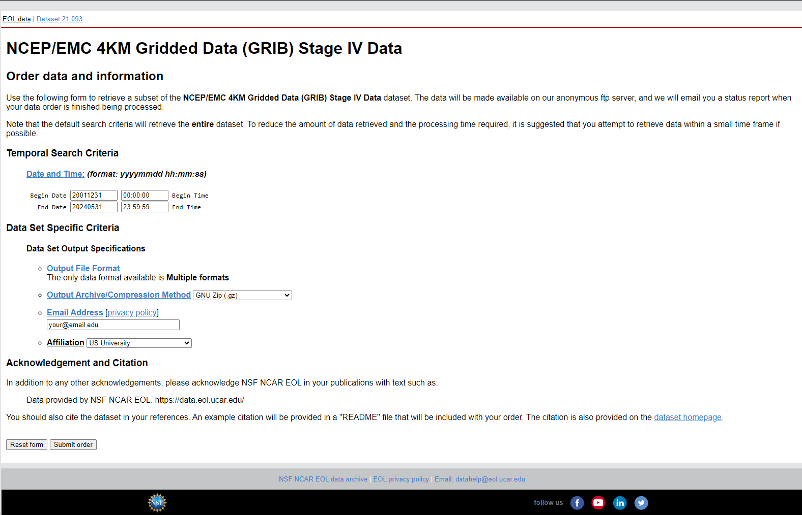

<p align="center">
  <a>
    
  </a>
</p>
<h1 align="center">Radar Data Processing and Conversion Project</h1>

## Overview
This project aims to process radar data files, convert them into GeoTIFF format, and subsequently convert these GeoTIFF files into ASCII format for the Texas state boundary. The project involves three main steps: downloading radar data, selecting appropriate data, and converting the data to the desired formats.

## Prerequisites
- **Operating System**: Windows
- **Software**:
  - R and RStudio
  - Java Runtime Environment (JRE)
  - WCT Tool (`wct-4.2.0-win32`)

## Project Structure
The directory structure for this project is as follows:

```
/working-directory
    /RadarData_to_Tiff_to_ASC.R
    /wctBatchConfig_updated.xml
    /Texas_State_Boundary/
        Texas_State_Boundary.shp
        Texas_State_Boundary.dbf
        Texas_State_Boundary.prj
        Texas_State_Boundary.shx
    /wct-4.2.0-win32/
        wct.exe
        other necessary files
    /RAW DATA/
        /2021/
            radar_data_files
        /2022/
            radar_data_files
        /2023/
            radar_data_files
    /OUTPUT/
```

## Step 1: Requesting Data from NSF NCAR EOL

1. **Access the Website**:
   Go to the [NSF NCAR EOL Data Archive](https://data.eol.ucar.edu/cgi-bin/codiac/fgr_form/id=21.093).

2. **Select Date Range**:
   - **Begin Date**: Set the start date for the data you need.
   - **End Date**: Set the end date for the data you need. Note that you can only request up to 3 months of data per order and up to 4 years of data per day.

3. **Specify Output Options**:
   - **Output Archive/Compression Method**: Select `GNU Zip (.gz)`.
   - **Email Address**: Enter your email address.
   - **Affiliation**: Select your affiliation from the dropdown menu.

4. **Submit the Order**:
   Click the "Submit order" button to request the data.

<p align="center">
  <a>
    
  </a>
</p>

#### Example Email Received
After submitting your data request, you will receive an email with download instructions. Use the provided FTP details to download the data using the `wget` command:

```sh
wget -rc -nH --cut-dirs=3 --no-netrc --ftp-user=anonymous ftp://data.eol.ucar.edu/pub/download/data/your_directory/
```

## Step 2: Selecting and Organizing the Appropriate Data

After downloading the data, use the provided Python script `copyTargetFiles.py` to select files with the required frequency and accumulate them into a single folder. The put the year-wise folders into the 'RAW DATA' folder.

### Python Script: `copyTargetFiles.py`

```python
import os
import shutil
import re

def copyTargetFiles(source_folders, destination_folder):
    """
    Copies files matching a specific naming convention from multiple source folders to a destination folder.

    This function searches through the specified source folders for files that match the naming
    convention 'st4_conus.2023MMDDHH.01h.grb2.gz' where '2023MMDDHH' is any valid date and hour of 2023.
    Matched files are then copied to the destination folder.

    Parameters:
    - source_folders (list of str): List of source folder paths to search for files.
    - destination_folder (str): Path to the destination folder where matched files will be copied.

    Example Usage:
    --------------
    source_folders = ['A', 'B', 'C']
    destination_folder = 'F'
    copyTargetFiles(source_folders, destination_folder)
    """

    # Create the destination folder if it doesn't exist
    if not os.path.exists(destination_folder):
        os.makedirs(destination_folder)

    # Define the regex pattern for the naming convention
    pattern = re.compile(r'^st4_conus\.2023\d{6}\.01h\.grb2\.gz$')

    # Iterate over each source folder
    for folder in source_folders:
        print(f"Checking folder: {folder}")
        for filename in os.listdir(folder):
            print(f"Found file: {filename}")
            if pattern.match(filename):
                print(f"Matched file: {filename}")
                # Construct the full file paths
                source_file = os.path.join(folder, filename)
                destination_file = os.path.join(destination_folder, filename)
                print(f"Copying from {source_file} to {destination_file}")
                
                # Copy the file to the destination folder
                shutil.copy2(source_file, destination_file)

    print("Files copied successfully.")

# Example usage
copyTargetFiles(['mahbu1141503', 'Mahbu1149534', 'Mahbu1224557', 'Mahbu1267555'], '2023')
```

## Step 3: Converting Radar Data to TIFF and ASC Files

### R Script: `RadarData_to_Tiff_to_ASC.R`

The provided script converts radar data files into GeoTIFF format and subsequently into ASCII format for the Texas state boundary.

#### Libraries Required
Install the necessary packages in R:

```r
install.packages(c("raster", "rgdal", "XML", "data.table", "parallel", "doSNOW", "dplyr", "tools", "future", "furrr", "purrr"))
```

#### Setting Up Java Environment
Ensure you have Java installed on your system. Download it from the [official Java website](https://www.java.com/en/download/).

#### Download and Install WCT Tool
Ensure to download the WCT tool from the NOAA Weather and Climate Toolkit page (Please unzip the wct-4.2.0-win32.zip file). Download it from the [official NOAA NCEI download page](https://www.ncdc.noaa.gov/wct/install.php).

#### Verify WCT Tool Installation
The `wct-4.2.0-win32` folder should contain all necessary files, including `wct.exe`. Verify the installation by running `wct.exe`:

- Navigate to the `wct-4.2.0-win32` directory in your command prompt.
- Execute the `wct.exe` file to check if it runs without errors.

#### Running the Script
Open RStudio, set the working directory to the folder containing the script, and run the `RadarData_to_Tiff_to_ASC.R` script.

```r
setwd("path/to/working/directory")
source("RadarData_to_Tiff_to_ASC.R")
```

### Summary
This project involves downloading radar data, selecting appropriate files, and converting them to GeoTIFF and ASCII formats. Ensure all necessary tools and packages are installed, and follow the steps outlined to complete the data processing.